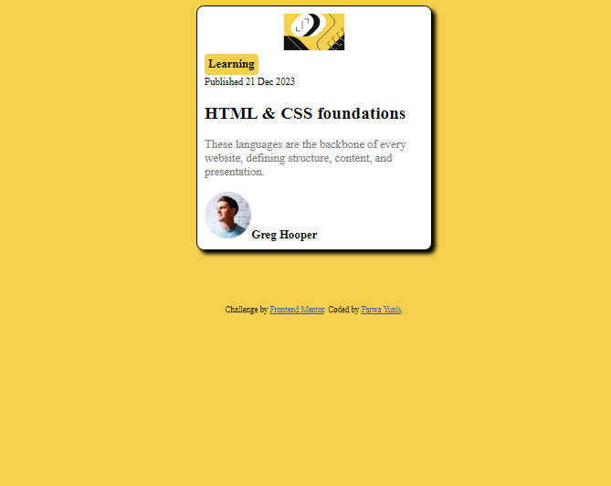

# Frontend Mentor - Blog preview card solution

This is a solution to the [Blog preview card challenge on Frontend Mentor](https://www.frontendmentor.io/challenges/blog-preview-card-ckPaj01IcS). Frontend Mentor challenges help you improve your coding skills by building realistic projects. 

## Table of contents

- [Overview](#overview)
  - [The challenge](#the-challenge)
  - [Screenshot](#screenshot)
  - [Links](#links)
- [My process](#my-process)
  - [Built with](#built-with)
  - [What I learned](#what-i-learned)
  - [Continued development](#continued-development)
  - [Useful resources](#useful-resources)
- [Author](#author)
- [Acknowledgments](#acknowledgments)

## Overview
Our card for blogging The goal of the HTML/CSS project is to develop practical and aesthetically pleasing blog cards that can be used to showcase blog post samples on a website. Stylistic elements like a border, border-radius, and light box-shadow. The card's top half is occupied by the image, then the title and description. The hover effect and contrasting color of the 'Read More' link draw attention to it and encourage people to explore further. This project provides an adaptable framework for effectively and aesthetically presenting blog content on any website.

### The challenge

Users should be able to:

- See hover and focus states for all interactive elements on the page

### Screenshot

### Links

- Solution URL: (https://github.com/farwaayunis/blog-preview-card-main.git)
- Live Site URL:(https://farwaayunis.github.io/blog-preview-card-main/)

## Author

- Website - [Farwa Malik](https://farwaayunis.github.io/blog-preview-card-main/)
- Frontend Mentor - [@farwayunis](https://www.frontendmentor.io/profile/farwaayunis)

